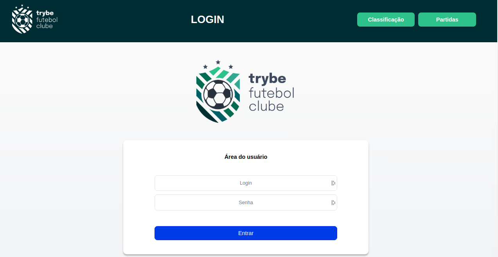
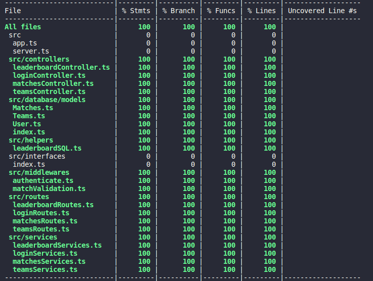

# Bem-vindo ao Projeto Trybe Futebol Clube!



Este é um projeto da [Trybe](https://www.betrybe.com/) desenvolvido no módulo de Back-end.
O TFC é um site informativo sobre partidas e classificações de futebol. 

Nele foi desenvolvida uma API utilizando o método ***TDD*** (Test Driven Development) e feita a sua integração com um front-end (previamente disponibilizado pela Trybe) com um banco de dados ***MySQL***.
O projeto segue o paradigma de programação ***POO*** (Programação orientada a objetos) para sua construção.

## Linguagens e Tecnologias

Em seu desenvolvimento foi utilizada linguagem ***TypeScript*** para escrever os códigos e ***Node.js*** juntamente com o framework ***Express*** para fornecer toda a estrutura para a construção dos endpoints da aplicação. 

Foi utilizado o ORM ***Sequelize***, que é o responsável por toda a consulta e manipulação do banco de dados MySQL.

Para a geração e verificação de tokens foi utilizado o ***JWT*** (JSON Web Token), possibilitando a verificação e autenticação de usuários, além de verificar e se tal tem permissões de administrador para realizar determinadas ações, como cadastrar, atualizar ou finalizar partidas.

E por fim, para os testes de integração foi utilizado ***Mocha*** e ***Chai*** para estruturar os testes e fazer as asserções.

## O que foi desenvolvido

  - Banco de dados MySQL utilizando o Sequelize com tabelas que armazenam informações dos usuários, informações dos times e informaçẽs das partidas; 
  - Endpoints que lêem e escrevem em um banco de dados MySQL;
  - Middlewares que realizam verificações dos dados enviados nas requisições;
  - Divisão da aplicação em camadas (arquitetura MSC);
  - Testes de integração que dão uma maior segurança para aplicação como um todo.

## Como rodar o projeto na sua máquina utilizando o Docker:

<details>
<summary><strong> ⚠️ Configurações mínimas para rodar o projeto</strong></summary>
<br/>
Na sua máquina você deve ter:

- Sistema Operacional Distribuição Unix;
- Node versão igual ou superior à 16.14.0 LTS;
- Docker;
- Docker-compose versão igual ou superior à 1.29.2.
</details>

1. Clone repositório:
```
git clone git@github.com:pauloricardosb/tfc-project.git
```

2. Acesse o diretório do projeto e instale as dependências necessárias:
```
cd tfc-project
npm install
```

3. Por fim, suba o container Docker para rodar os serviços utilizando o comando:
```
npm run compose:up
```

> ℹ️ Ao subir a aplicação, o serviço de Front-end estará rodando na port 3000 da sua máquina, o Back-end estará rodando na porta 3001 e o banco de dados MySQL estará rodando na porta 3002.

4. Para rodar os testes de integração e verificar a sua cobertura são utilizados os seguintes comandos:

```
cd app/backend && npm run test:coverage
```

Se tudo funcionou perfeitamente, o retorno deve ser algo como:



## Endpoints da API:

#### Login

|Método |Funcionalidade                                                                     |URL                                          |
|:-----:|:---------------------------------------------------------------------------------:|:-------------------------------------------:|
|`POST` |Realiza login do usuário e retorna um token para autenticação                      |http://localhost:3001/login                  |
|`GET`  |Verifica se o usuário está logado e retorna a sua função (administrador ou usuário)|http://localhost:3001/login/validate         |

Na requisição `POST`, é necessário informar um JSON no seguinte formato:

```
{
  "email": "admin@admin.com",
  "password": "secret_admin"
}
```

#### Times

|Método |Funcionalidade                                                                    |URL                                           |
|:-----:|:--------------------------------------------------------------------------------:|:--------------------------------------------:|
|`GET`  |Retorna todos os times cadastrados no banco de dados                              |http://localhost:3001/teams                   |
|`GET`  |Retorna um time específico com base em seu ID                                     |http://localhost:3001/teams/:id               |

#### Partidas

|Método |Funcionalidade                                                                    |URL                                           |
|:-----:|:--------------------------------------------------------------------------------:|:--------------------------------------------:|
|`GET`  |Retorna todas as partidas do campeonato                                           |http://localhost:3001/matches                 |
|`GET`  |Retorna as partidas que estão em andamento                                        |http://localhost:3001/matches?inProgress=true |
|`GET`  |Retorna as partidas já finalizadas                                                |http://localhost:3001/matches?inProgress=false|
|`POST` |Cadastra uma nova partida e retorna esta partida cadastrada                       |http://localhost:3001/matches                 |
|`PATCH`|Finaliza uma partida em andamento baseado em seu ID                               |http://localhost:3001/matches/:id/finish      |
|`PATCH`|Atualiza o resultado de uma partida em andamento com base em seu ID               |http://localhost:3001/matches/:id             |


Na requisição `POST` é necessário informar um JSON no seguinte formato:

```
{
  "homeTeam": 16,
  "awayTeam": 8,
  "homeTeamGoals": 2,
  "awayTeamGoals": 2
}
```


Na requisição `PATCH` que atualiza o resultado é necessário informar um JSON no seguinte formato:

```
{
  "homeTeamGoals": 3,
  "awayTeamGoals": 1
}
```

#### Classificação

|Método |Funcionalidade                                                                    |URL                                           |
|:-----:|:--------------------------------------------------------------------------------:|:--------------------------------------------:|
|`GET`  |Retorna a classificação dos times da casa com base nas partidas já finalizadas    |http://localhost:3001/leaderboard/home        |
|`GET`  |Retorna a classificação dos times visitantes com base nas partidas já finalizadas |http://localhost:3001/leaderboard/away        |
|`GET`  |Retorna a classificação geral com base nas partidas já finalizadas                |http://localhost:3001/leaderboard             |


<br>
<br>

<p align="center" > README criado por <a href="https://github.com/Tayna-Silva-Macedo" >Tayna Macedo</a> 🌻 </p>  
